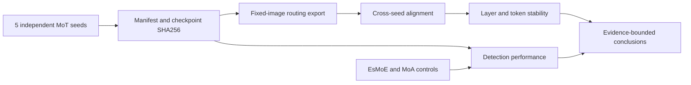

# YOLO-Master Issue #54:
# Audited Multi-Seed MoT Routing Stability and Architecture Controls

_A reproducible study of cross-seed MoT routing stability, architecture controls, and evidence integrity on
VisDrone2019-DET._

**This is an independent research portfolio and is not an official Tencent repository.**

**English** · [中文](README_CN.md)

[Results](docs/RESULTS_AND_LIMITATIONS.md) ·
[Routing stability](docs/ROUTING_STABILITY.md) ·
[Architecture controls](docs/ARCHITECTURE_CONTROLS.md) ·
[Reproduction](docs/REPRODUCTION.md) ·
[Provenance](provenance/README.md) ·
[Contributions](contributions/README.md) ·
[Citation](CITATION.cff)

This repository curates the completed research associated with
[Tencent/YOLO-Master Issue #54](https://github.com/Tencent/YOLO-Master/issues/54) and
[Draft PR #216](https://github.com/Tencent/YOLO-Master/pull/216). It is a compact public evidence package, not a
copy of Tencent/YOLO-Master. Ownership, source boundaries, and excluded evidence are recorded file by file.

> [!IMPORTANT]
> **Main result:** detection performance is relatively stable across five independently trained MoT seeds, while
> internal expert routing shows only moderate or low cross-seed agreement with substantial layer-level variation.

## At a glance

| Area | Scope |
|---|---|
| Upstream | Tencent/YOLO-Master Issue #54 |
| Dataset | VisDrone2019-DET |
| MoT repetitions | 5 independently trained seeds |
| Routing evidence | 32 fixed images, 6 layers, 3 experts |
| Controls | EsMoE n=3, MoA n=1 |
| Integrity | Manifest, registry, checkpoint SHA256 |
| Public assets | Reports, tables, figures, scripts, provenance |
| Excluded | Checkpoints, datasets, raw logs, large raw JSON |

## Key findings

- The five MoT runs have distinct checkpoint SHA256 values and produce mAP50 `0.16037 ± 0.00293` and mAP50-95
  `0.08311 ± 0.00183` (mean ± sample SD).
- Global routing agreement is lower: dominant-expert agreement is approximately `0.526`, and token top-1
  agreement is approximately `0.435`.
- Layer behavior varies strongly. Dominant agreement ranges from `0.200` to `1.000`; token top-1 agreement ranges
  from `0.200` to `0.876`.
- Repeated export from the same checkpoints passed all `960/960` recorded determinism checks; cross-seed
  disagreement is therefore distinct from same-checkpoint export repeatability in this evidence.
- EsMoE and MoT have similar descriptive mean detection metrics under this protocol. MoA has one seed and no valid
  between-seed variance estimate.

These observations do not establish a causal link between routing agreement and accuracy. They also do not assign
fixed semantic roles to experts or show that high entropy means high stability.

## Formal experiment scope

| Architecture | Model key | Independent seeds | Precision | Epochs | Batch | Image size |
|---|---|---:|---|---:|---:|---:|
| EsMoE | `v10` | 3 (`0,1,2`) | AMP | 30 | 8 | 640 |
| MoA | `v10_moa` | 1 (`0`) | AMP | 30 | 8 | 640 |
| MoT | `v10_mot` | 5 (`0,1,2,3,4`) | FP32 | 30 | 8 | 640 |

All nine formal runs have `status=passed`, completed 30 epochs, and carry mutually distinct checkpoint hashes.
Only MoT has routing evidence; no MoT-style routing record is fabricated for EsMoE or MoA.

The highest experimental unit is an independently trained seed. The 32 images, six layers, tokens, repeated
exports, and ten seed pairs do not increase the training repetition count.

## Key audited results

### Detection performance

| Architecture | Seeds | mAP50 | mAP50-95 | Statistical scope |
|---|---:|---:|---:|---|
| EsMoE | 3 | `0.16001 ± 0.00350` | `0.08368 ± 0.00200` | Mean ± sample SD |
| MoA | 1 | `0.15844` | `0.08164` | Single-seed descriptive control |
| MoT | 5 | `0.16037 ± 0.00293` | `0.08311 ± 0.00183` | Mean ± sample SD |

Seed counts and precision modes differ, so this is a descriptive architecture control, not a balanced hypothesis
test or a claim of superiority.


_Architecture controls · VisDrone2019-DET · unequal independent-seed counts · MoA is explicitly single-seed._

### Five-seed MoT performance

| Seed | mAP50 | mAP50-95 | Checkpoint identity |
|---:|---:|---:|---|
| 0 | `0.16189` | `0.08469` | Unique SHA256 |
| 1 | `0.15701` | `0.08056` | Unique SHA256 |
| 2 | `0.16176` | `0.08392` | Unique SHA256 |
| 3 | `0.16364` | `0.08457` | Unique SHA256 |
| 4 | `0.15753` | `0.08182` | Unique SHA256 |


_Every point is one independently trained checkpoint. Images and tokens are not treated as repetitions._

The complete hashes are in [the MoT seed table](results/tables/mot_seed_metrics.csv) and
[checkpoint index](results/tables/checkpoint_index.csv). Checkpoint binaries are not included.

### Cross-seed MoT routing stability

| Layer | Dominant agreement | Token top-1 agreement |
|---|---:|---:|
| `model.14.m.0` | `0.621875` | `0.339736` |
| `model.14.m.1` | `0.346875` | `0.340252` |
| `model.20.m.0` | `0.737500` | `0.534416` |
| `model.20.m.1` | `0.250000` | `0.321607` |
| `model.23.m.0` | `1.000000` | `0.876156` |
| `model.23.m.1` | `0.200000` | `0.200000` |


_Six layers in architecture order · 5 seeds · 32 fixed validation images · 10 seed pairs._

Route entropy is intentionally not plotted as stability. Entropy describes how probability mass is distributed
within a route; agreement asks whether independently trained seeds make the same routing choices.

See [Routing stability](docs/ROUTING_STABILITY.md) for pairwise agreement, Jensen-Shannon divergence, utilization,
repeated-export evidence, and interpretation limits.

## What I contributed

### Upstream foundation

Tencent/YOLO-Master and its Ultralytics foundation provide the detector framework, training engine, model families,
and the original Issue #54 research direction. Those components are not claimed as personal work.

### Issue #54 research and engineering work

The contribution recorded in the audited branch and Draft PR #216 includes:

- versioned experiment manifests and a formal registry;
- checkpoint SHA256 validation and duplicate-checkpoint rejection;
- explicit prevention of representing one checkpoint as multiple independent seeds;
- deterministic fixed-image MoT routing export;
- cross-seed alignment by image, layer, expert, and checkpoint identity;
- dominant-expert agreement, token top-1 agreement, Jensen-Shannon divergence, entropy, and utilization metrics;
- strict serial formal queues and isolated architecture-control runners;
- EsMoE and MoA controls kept separate from MoT routing evidence;
- AMP dtype repair for MoT sparse fusion;
- Torch 1.8 autocast compatibility;
- ONNX/TorchScript export-safe out-of-place scatter;
- a real dense exploration gradient path for positive `exploration_eps`;
- legacy-safe routing reductions;
- shared routed-module protocol compatibility;
- MoA sparse parameter aliases and normalization compatibility;
- cross-platform CI fixes, tests, formal reports, and provenance.

Exact commit ownership and changed paths are documented in [the commit map](contributions/COMMIT_MAP.md). The two
most focused compatibility commits are preserved as [mail-format patches](patches/README.md).

### Portfolio-only outputs

This repository adds compact public tables, deterministic figures, bilingual documentation, publication policy,
source manifests, and validators. Those are generated or authored for this personal portfolio and are separate
from the upstream framework.

## Evidence flow



The diagram is a navigation aid. The formal CSVs, recorded SHA256 values, report manifest, and source manifest are
the authoritative public evidence.

## Reproduction quick start

The following commands validate and rebuild this portfolio only; they do not train, infer, download data, export
routing, or use a GPU.

```bash
python -m pip install matplotlib numpy pillow pyyaml ruff
python scripts/validation/validate_results.py
python scripts/analysis/build_portfolio_figures.py
python scripts/analysis/build_portfolio_figures.py --check
python scripts/validation/build_manifests.py
python scripts/validation/validate_public_repository.py
```

Training reproduction requires a separate checkout of Tencent/YOLO-Master, separately obtained VisDrone data,
and an output root outside this portfolio. Start with the recorded protocol and review upstream dry-run commands;
no command on this landing page launches training.

See [Reproduction](docs/REPRODUCTION.md) for environment boundaries, source checkout, data preparation, formal
entry points, and the no-compute default.

## Repository map

| Start here | Purpose |
|---|---|
| [Documentation index](docs/INDEX.md) | Five-minute, result-review, and full-audit paths |
| [Results guide](results/README.md) | Six tables and five generated figures |
| [Routing stability](docs/ROUTING_STABILITY.md) | Layer, pairwise, utilization, entropy, and determinism evidence |
| [Architecture controls](docs/ARCHITECTURE_CONTROLS.md) | Unequal-seed descriptive comparison |
| [Reproduction](docs/REPRODUCTION.md) | Offline validation and separate-upstream workflow |
| [Provenance](provenance/README.md) | File-level origin, hashes, and private evidence index |
| [Contributions](contributions/README.md) | Issue, PR, commit, and patch boundaries |
| [Models](models/README.md) | Metadata-only index and no-weights policy |

## Upstream contribution status

This is a dated snapshot from **2026-08-03 (Asia/Shanghai)**, not a live badge.

| Item | Recorded state |
|---|---|
| Official Issue #54 | Open |
| PR #216 | Open, Draft |
| Base / head | `Tencent:main` ← `PinkTulips139:issue54-mot-routing-stability` |
| Head commit | `dd490a80840dd70836e9363e14630039c7086a87` |
| PR snapshot | 13 commits, 100 changed files |
| Latest-head checks | 9 passed, 3 pending, 5 skipped |

PR #216 is not recorded as merged or accepted. Its current-head CI was not fully complete at the snapshot, so this
repository does not display an older all-green screenshot as if it applied to `dd490a8`.

See [the PR record](contributions/PR_216.md), [dated status snapshot](provenance/PR_STATUS.md), and
[manual screenshot checklist](docs/screenshots/SCREENSHOT_CHECKLIST.md).

## Models and datasets

No checkpoint or dataset is committed. The public model index contains nine metadata rows and zero released
weights. Every checkpoint record has `public_checkpoint=false` and reason
`metadata-only; checkpoint binary not included`.

VisDrone2019-DET must be obtained separately. The path-parameterized public YAML is not a dataset mirror, and this
repository's AGPL-3.0 license does not grant dataset or model-weight redistribution rights.

[Model card](models/MODEL_CARD.md) · [Checkpoint policy](models/CHECKPOINT_POLICY.md) ·
[Dataset policy](docs/DATASETS.md) · [Artifact policy](docs/ARTIFACT_POLICY.md)

## Limitations

- The architecture seed counts are unequal: MoT n=5, EsMoE n=3, and MoA n=1.
- MoT uses FP32 while EsMoE and MoA use AMP; comparisons are protocol-specific and descriptive.
- MoA has no between-seed variance estimate and no demonstrated cross-seed routing stability.
- Routing evidence uses 32 fixed validation images and six MoT layers from one dataset/protocol.
- Images, tokens, layers, repeated exports, and seed pairs are not independent training repetitions.
- High route entropy is not equivalent to high cross-seed agreement.
- Same-checkpoint determinism does not imply that independently trained seeds converge to the same routes.
- Routing disagreement is not shown to cause detection-performance differences.
- Expert utilization does not establish a fixed expert semantic role.
- Deterministic settings cannot guarantee bitwise equivalence for every CUDA kernel and environment.
- No checkpoint, dataset, raw log, or large raw routing JSON is public.
- PR #216 remains an open Draft at the dated snapshot; upstream acceptance is not implied.
- The study does not claim general architecture superiority, causal proof, state of the art, or universal behavior.

Read [Results and limitations](docs/RESULTS_AND_LIMITATIONS.md) and the [FAQ](docs/FAQ.md) before reusing a result
outside the recorded protocol.

## Citation, license, and acknowledgment

Use [CITATION.cff](CITATION.cff) to cite this artifact, and separately cite Tencent/YOLO-Master and VisDrone as
appropriate. The audited upstream `CITATION.cff` primarily described Ultralytics, so this portfolio does not guess
an additional YOLO-Master DOI; a manual citation review is recorded.

This repository is distributed under [AGPL-3.0](LICENSE). Copied or modified upstream material retains its original
ownership and terms. Personal text, tables, figure scripts, validators, and generated figures are identified in
[SOURCE_MANIFEST.csv](provenance/SOURCE_MANIFEST.csv). Third-party software, datasets, and trademarks are not
relicensed.

See [Third-party notices](THIRD_PARTY_NOTICES.md), [Project context](docs/PROJECT_CONTEXT.md), and
[Formal evidence hashes](results/manifests/FORMAL_EVIDENCE_HASHES.md). Acknowledgment belongs to Tencent/YOLO-Master
contributors, Ultralytics contributors, VisDrone creators, and the broader open-source ecosystem supporting this
work.
