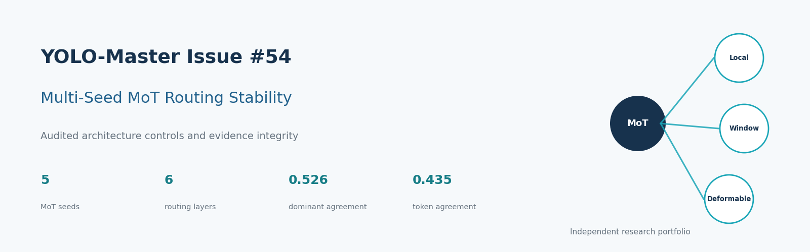
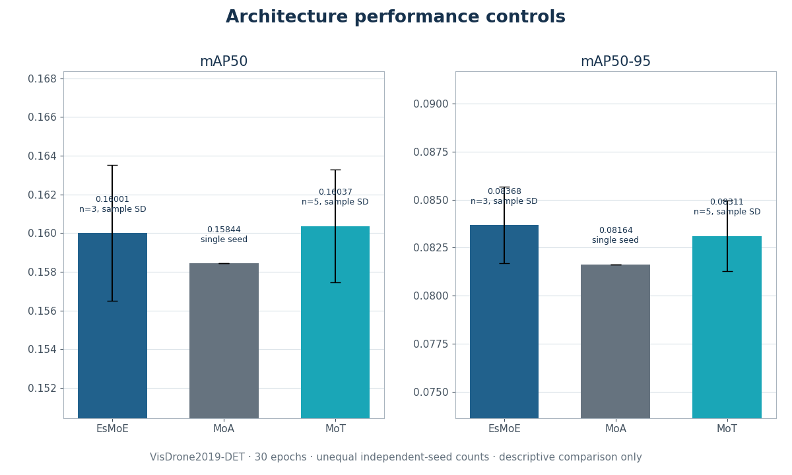
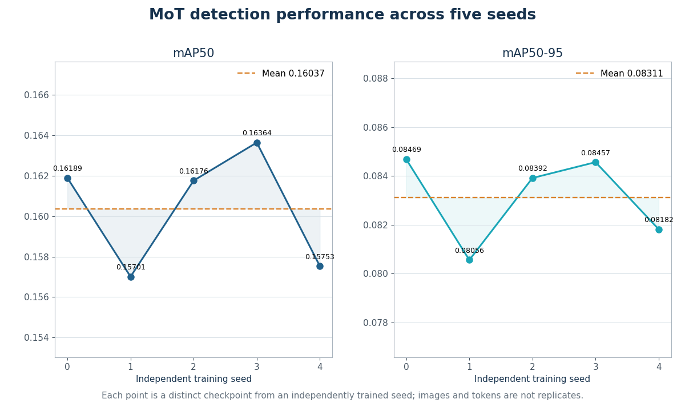
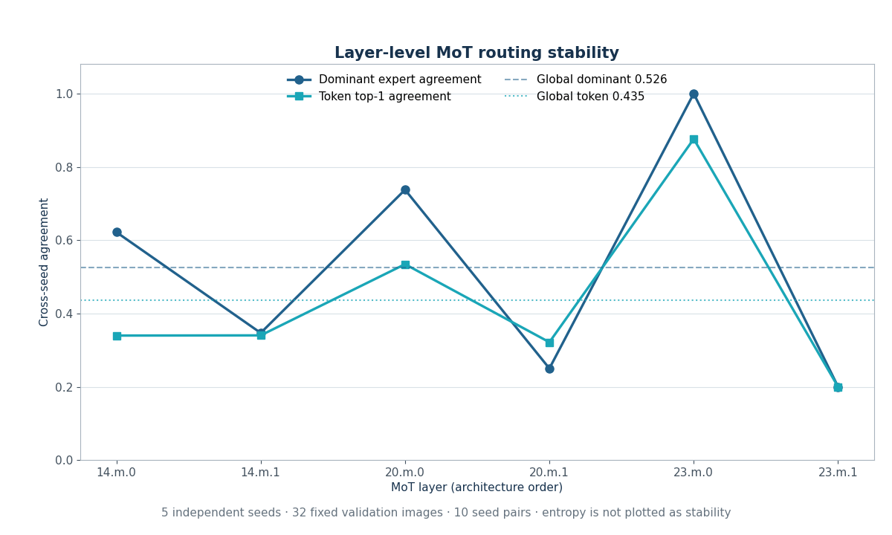
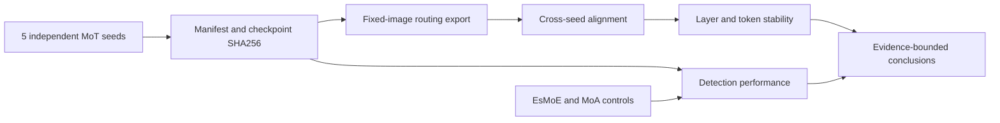

# YOLO-Master Issue #54：
# 经审计的多 Seed MoT 路由稳定性与架构对照

_一项面向 VisDrone2019-DET 的可复现研究，考察 MoT 跨 seed 路由稳定性、架构对照与证据完整性。_

**这是独立的个人研究成果仓库，不是 Tencent 官方仓库。**

[English](README.md) · **中文**

[结果](docs/RESULTS_AND_LIMITATIONS.md) ·
[路由稳定性](docs/ROUTING_STABILITY.md) ·
[架构对照](docs/ARCHITECTURE_CONTROLS.md) ·
[复现](docs/REPRODUCTION.md) ·
[来源追踪](provenance/README.md) ·
[贡献](contributions/README.md) ·
[引用](CITATION.cff)

本仓库整理与 [Tencent/YOLO-Master Issue #54](https://github.com/Tencent/YOLO-Master/issues/54) 和
[Draft PR #216](https://github.com/Tencent/YOLO-Master/pull/216) 相关的已完成研究。它是一份紧凑的公开证据包，
不是 Tencent/YOLO-Master 的完整副本。文件来源、归属边界以及未公开证据均有逐项记录。

> [!IMPORTANT]
> **主要结果：**五个独立训练 MoT seed 的检测性能相对稳定，但内部专家路由仅呈现中等或较低的跨 seed
> 一致性，并且层间差异明显。

## 项目概览

| 项目 | 范围 |
|---|---|
| 上游 | Tencent/YOLO-Master Issue #54 |
| 数据集 | VisDrone2019-DET |
| MoT 重复 | 5 个独立训练 seed |
| 路由证据 | 32 张固定图片、6 层、3 个专家 |
| 架构对照 | EsMoE n=3、MoA n=1 |
| 完整性 | Manifest、registry、checkpoint SHA256 |
| 公开内容 | 报告、表格、图、脚本、来源追踪 |
| 排除内容 | Checkpoint、数据集、原始日志、大型原始 JSON |

## 核心发现

- 五个 MoT checkpoint 的 SHA256 互不相同；mAP50 为 `0.16037 ± 0.00293`，mAP50-95 为
  `0.08311 ± 0.00183`（均值 ± 样本标准差）。
- 全局路由一致性较低：dominant-expert agreement 约为 `0.526`，token top-1 agreement 约为 `0.435`。
- 层间变化明显：dominant agreement 范围为 `0.200` 到 `1.000`，token top-1 agreement 范围为
  `0.200` 到 `0.876`。
- 同一 checkpoint 的重复导出记录为 `960/960` 通过；因此，在本证据中，跨 seed 差异与同 checkpoint
  的导出可重复性是两个不同问题。
- EsMoE 与 MoT 在当前协议下的描述性平均检测指标接近；MoA 只有一个 seed，不能估计 seed 间方差。

这些结果不支持把路由一致性与精度差异解释为因果关系，也不支持为专家赋予固定语义，或把高 entropy
等同于高稳定性。

## 正式实验范围

| 架构 | Model key | 独立 seed | 精度 | Epochs | Batch | 图像尺寸 |
|---|---|---:|---|---:|---:|---:|
| EsMoE | `v10` | 3（`0,1,2`） | AMP | 30 | 8 | 640 |
| MoA | `v10_moa` | 1（`0`） | AMP | 30 | 8 | 640 |
| MoT | `v10_mot` | 5（`0,1,2,3,4`） | FP32 | 30 | 8 | 640 |

九个正式运行均为 `status=passed`，完成 30 epochs，checkpoint hash 全部互异。路由证据只属于 MoT；
仓库没有为 EsMoE 或 MoA 虚构 MoT 路由记录。

最高实验单位是一次独立训练 seed。32 张图片、六层、token、重复导出以及十个 seed pair 都不会增加
独立训练重复数。

## 核心审计结果

### 检测性能

| 架构 | Seeds | mAP50 | mAP50-95 | 统计范围 |
|---|---:|---:|---:|---|
| EsMoE | 3 | `0.16001 ± 0.00350` | `0.08368 ± 0.00200` | 均值 ± 样本标准差 |
| MoA | 1 | `0.15844` | `0.08164` | 单 seed 描述性对照 |
| MoT | 5 | `0.16037 ± 0.00293` | `0.08311 ± 0.00183` | 均值 ± 样本标准差 |

各架构的 seed 数与精度模式并不一致，因此这里只做描述性对照，不构成平衡假设检验，也不支持“某架构
显著更优”的表述。



_架构对照 · VisDrone2019-DET · 独立 seed 数不等 · MoA 明确标为 single seed。_

### 五 Seed MoT 性能

| Seed | mAP50 | mAP50-95 | Checkpoint 身份 |
|---:|---:|---:|---|
| 0 | `0.16189` | `0.08469` | 唯一 SHA256 |
| 1 | `0.15701` | `0.08056` | 唯一 SHA256 |
| 2 | `0.16176` | `0.08392` | 唯一 SHA256 |
| 3 | `0.16364` | `0.08457` | 唯一 SHA256 |
| 4 | `0.15753` | `0.08182` | 唯一 SHA256 |



_每个点对应一个独立训练 checkpoint；图片与 token 不作为独立重复。_

完整 hash 见 [MoT seed 表](results/tables/mot_seed_metrics.csv)和
[checkpoint 索引](results/tables/checkpoint_index.csv)。仓库不包含 checkpoint 二进制文件。

### MoT 跨 Seed 路由稳定性

| 层 | Dominant agreement | Token top-1 agreement |
|---|---:|---:|
| `model.14.m.0` | `0.621875` | `0.339736` |
| `model.14.m.1` | `0.346875` | `0.340252` |
| `model.20.m.0` | `0.737500` | `0.534416` |
| `model.20.m.1` | `0.250000` | `0.321607` |
| `model.23.m.0` | `1.000000` | `0.876156` |
| `model.23.m.1` | `0.200000` | `0.200000` |



_按架构顺序展示六层 · 5 seeds · 32 张固定验证图片 · 10 个 seed pair。_

图中没有把 route entropy 画成 stability。Entropy 描述单次路由概率分布的离散程度；agreement 关注不同
独立训练 seed 是否给出相同选择。

Pairwise agreement、Jensen-Shannon divergence、utilization、重复导出与推断边界见
[路由稳定性文档](docs/ROUTING_STABILITY.md)。

## 本人贡献

### 上游基础

Tencent/YOLO-Master 及其 Ultralytics 基础提供目标检测框架、训练引擎、模型族与 Issue #54 原始方向。
这些内容不作为个人原创成果申领。

### Issue #54 研究与工程工作

审计分支与 Draft PR #216 中记录的贡献包括：

- 版本化 experiment manifest 与正式 registry；
- checkpoint SHA256 验证与重复 checkpoint 拒绝；
- 防止把同一 checkpoint 计作多个独立 seed；
- 固定图片、可重复的 MoT routing export；
- 按图片、层、专家与 checkpoint 身份进行跨 seed 对齐；
- dominant agreement、token top-1 agreement、JSD、entropy 与 utilization 指标；
- 严格串行正式队列与隔离的架构对照 runner；
- EsMoE、MoA 对照与 MoT 路由证据分离；
- MoT sparse fusion 的 AMP dtype 修复；
- Torch 1.8 autocast 兼容；
- ONNX/TorchScript export-safe 非原地 scatter；
- `exploration_eps > 0` 时真实的 dense exploration 梯度路径；
- 兼容旧版 Torch 的 routing reduction；
- routed-module protocol 兼容；
- MoA sparse 参数别名与归一化兼容；
- 跨平台 CI 修复、测试、正式报告与 provenance。

具体提交和文件边界见[提交映射](contributions/COMMIT_MAP.md)，两项集中兼容修复见
[邮件格式 patch](patches/README.md)。这些记录不表示 PR 已被 Tencent 合并。

### 仅属于个人成果仓库的产物

本仓库另外新增紧凑公开表、确定性图表、双语文档、发布政策、来源 manifest 和 validator；这些内容与
上游框架代码明确分开。

## 证据流



Mermaid 图只用于导航。正式 CSV、checkpoint SHA256、report manifest 与 source manifest 才是公开证据依据。

## 快速复现

以下命令只验证并重建个人成果仓库，不训练、不推理、不下载数据、不导出路由，也不调用 GPU：

```bash
python -m pip install matplotlib numpy pillow pyyaml ruff
python scripts/validation/validate_results.py
python scripts/analysis/build_portfolio_figures.py
python scripts/analysis/build_portfolio_figures.py --check
python scripts/validation/build_manifests.py
python scripts/validation/validate_public_repository.py
```

训练复现必须使用单独取得的 Tencent/YOLO-Master checkout、单独取得的 VisDrone 数据，以及位于本成果仓库
之外的输出目录。首页不提供直接启动训练的命令。环境与正式入口见[复现文档](docs/REPRODUCTION.md)。

## 仓库导航

| 入口 | 用途 |
|---|---|
| [文档索引](docs/INDEX.md) | 5 分钟、15 分钟与完整审计阅读路径 |
| [结果说明](results/README.md) | 六张表与五张确定性结果图 |
| [路由稳定性](docs/ROUTING_STABILITY.md) | 层、pairwise、utilization、entropy 与 determinism |
| [架构对照](docs/ARCHITECTURE_CONTROLS.md) | Seed 数不等的描述性比较 |
| [复现](docs/REPRODUCTION.md) | 离线验证与独立上游工作流 |
| [来源追踪](provenance/README.md) | 文件来源、hash 与私人证据索引 |
| [贡献](contributions/README.md) | Issue、PR、commit 和 patch 边界 |
| [模型](models/README.md) | 仅元数据索引与不发布权重政策 |

## 上游贡献状态

以下是 **2026-08-03（Asia/Shanghai）** 的日期快照，不是实时状态徽章。

| 项目 | 记录状态 |
|---|---|
| 官方 Issue #54 | Open |
| PR #216 | Open、Draft |
| Base / head | `Tencent:main` ← `PinkTulips139:issue54-mot-routing-stability` |
| Head commit | `dd490a80840dd70836e9363e14630039c7086a87` |
| PR 快照 | 13 commits、100 changed files |
| 最新 head 检查 | 9 passed、3 pending、5 skipped |

PR #216 没有被记录为 merged 或已接受。快照时当前 head 的 CI 尚未全部结束，因此本仓库不会拿旧的全绿截图
冒充 `dd490a8` 的最新状态。详见 [PR 记录](contributions/PR_216.md)、[状态快照](provenance/PR_STATUS.md)和
[手工截图清单](docs/screenshots/SCREENSHOT_CHECKLIST.md)。

## 模型与数据集

Git 中不包含 checkpoint 或数据集。模型索引只有九条正式 metadata，公开权重数量为 0；所有 checkpoint
均记录 `public_checkpoint=false`，原因为 `metadata-only; checkpoint binary not included`。

VisDrone2019-DET 需要单独获取。公开 YAML 只是路径模板，不是数据镜像；本仓库的 AGPL-3.0 也不授予数据
或模型权重的再分发权。

[模型卡](models/MODEL_CARD.md) · [Checkpoint 政策](models/CHECKPOINT_POLICY.md) ·
[数据集政策](docs/DATASETS.md) · [产物政策](docs/ARTIFACT_POLICY.md)

## 主要限制

- 架构 seed 数不相等：MoT n=5、EsMoE n=3、MoA n=1。
- MoT 使用 FP32，EsMoE 与 MoA 使用 AMP；比较仅适用于当前协议，且是描述性的。
- MoA 没有 seed 间方差估计，也没有跨 seed 路由稳定性证据。
- 路由证据只覆盖一个数据集、32 张固定验证图片和六个 MoT 层。
- 图片、token、层、重复导出与 seed pair 都不是独立训练重复。
- 高 route entropy 不等于高跨 seed agreement。
- 同 checkpoint 可重复不代表不同训练 seed 会收敛到相同路由。
- 当前证据不能说明路由差异导致检测性能差异。
- Expert utilization 不能证明某个专家具有固定语义。
- Deterministic 设置不能保证所有 CUDA kernel 和环境逐 bit 一致。
- 公开仓库没有 checkpoint、数据集、原始日志或大型原始 routing JSON。
- 日期快照中 PR #216 仍为 Open Draft，不代表已被上游接受。
- 本研究不声称普遍架构优势、因果证明、SOTA 或通用行为。

在其他场景引用结果前，请阅读[结果与限制](docs/RESULTS_AND_LIMITATIONS.md)和 [FAQ](docs/FAQ.md)。

## 引用、许可证与致谢

引用本成果请使用 [CITATION.cff](CITATION.cff)，并按需要分别引用 Tencent/YOLO-Master 与 VisDrone。
审计到的上游 `CITATION.cff` 主要描述 Ultralytics，因此本仓库没有猜测额外的 YOLO-Master DOI，并保留
manual citation review 说明。

本仓库采用 [AGPL-3.0](LICENSE)。复制或修改的上游材料保留原始归属与条款；个人新增文字、表格、绘图脚本、
validator 和生成图在 [SOURCE_MANIFEST.csv](provenance/SOURCE_MANIFEST.csv) 中分类。第三方软件、数据集与商标
不会因本仓库而被重新授权。

更多信息见[第三方声明](THIRD_PARTY_NOTICES.md)、[项目背景](docs/PROJECT_CONTEXT.md)和
[正式证据 hash](results/manifests/FORMAL_EVIDENCE_HASHES.md)。感谢 Tencent/YOLO-Master、Ultralytics、VisDrone
及相关开源社区贡献者。
