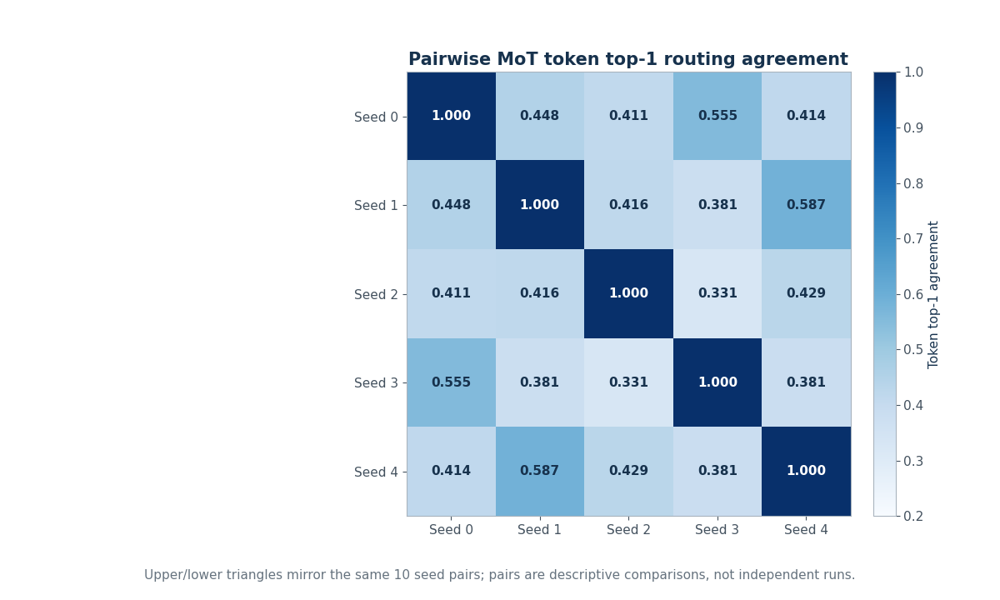
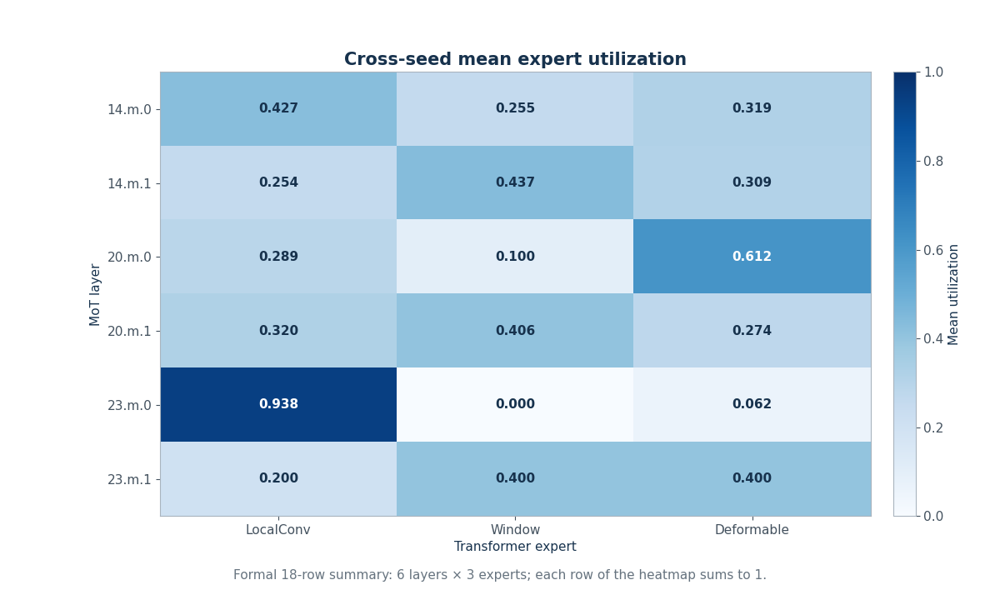

# MoT routing stability

## Global result

Across five independently trained MoT seeds, 32 fixed validation images, six layers, and ten seed pairs:

- mean dominant-expert agreement: `0.5260416667`;
- mean token top-1 agreement: `0.4353613281`;
- mean Jensen-Shannon divergence: `0.0000354320`;
- repeated same-checkpoint export checks: `960/960` passed.

Detection performance can therefore be relatively stable while route identity remains only moderately or weakly
reproduced across seeds. This is a descriptive coexistence, not a causal conclusion.

## Layer-level results

| Architecture order | Layer | Dominant agreement | Token top-1 agreement |
|---:|---|---:|---:|
| 1 | `model.14.m.0` | 0.621875 | 0.339736 |
| 2 | `model.14.m.1` | 0.346875 | 0.340252 |
| 3 | `model.20.m.0` | 0.737500 | 0.534416 |
| 4 | `model.20.m.1` | 0.250000 | 0.321607 |
| 5 | `model.23.m.0` | 1.000000 | 0.876156 |
| 6 | `model.23.m.1` | 0.200000 | 0.200000 |

The ranking is metric-specific. A layer with dominant agreement 1.0 can still have token agreement below 1.0.

## Pairwise results

The public ten-row table averages each seed pair over its 192 aligned image-layer comparisons. Token agreement
ranges from approximately `0.331` to `0.587` among off-diagonal pairs.

The symmetric heatmap mirrors the same ten pairs above and below the diagonal. It does not create 20 observations,
and the ten pairs are not ten independent training repetitions.

## Expert utilization

The formal utilization summary contains 18 rows: six layers × three experts. Every layer's cross-seed mean shares
sum to approximately 1.

Large layer-level utilization differences are measurements of selection frequency. They do not prove that an
expert has a fixed object, scale, density, or occlusion semantics.

## Entropy versus agreement

Route entropy is close to the three-expert theoretical maximum in the formal report. That fact describes dispersed
probability mass within a route. Cross-seed agreement instead compares route choices between independently trained
models. High entropy can coexist with high, moderate, or low agreement; it must not be renamed “stability.”

## Same-checkpoint repeatability

All 960 recorded repeated-inference rows passed the determinism gate, and same-checkpoint token agreement was 1.0.
This supports deterministic export for the recorded inputs/environment. It does not imply identical training or
routes across different random seeds.

## What cannot be inferred

- Routing disagreement necessarily reduces detection performance.
- Any expert has a fixed semantic role.
- Occlusion, density, or object size caused the observed routes.
- Higher entropy means higher stability.
- Images, tokens, layers, or seed pairs replace independent training repetitions.
- The six-layer pattern generalizes beyond the recorded model, dataset, and protocol.

Source values: [layer table](../results/tables/mot_layer_stability.csv),
[pairwise table](../results/tables/pairwise_seed_summary.csv), and
[utilization table](../results/tables/expert_utilization_summary.csv).
